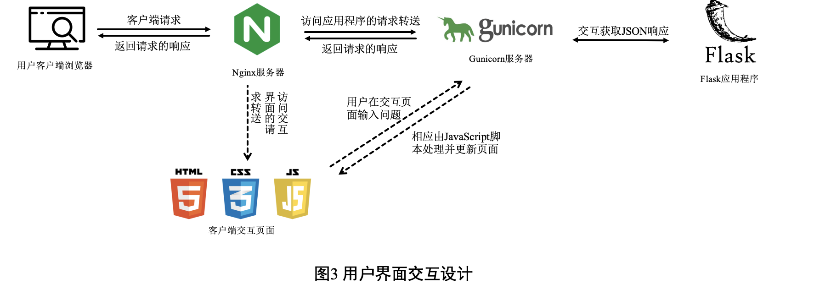
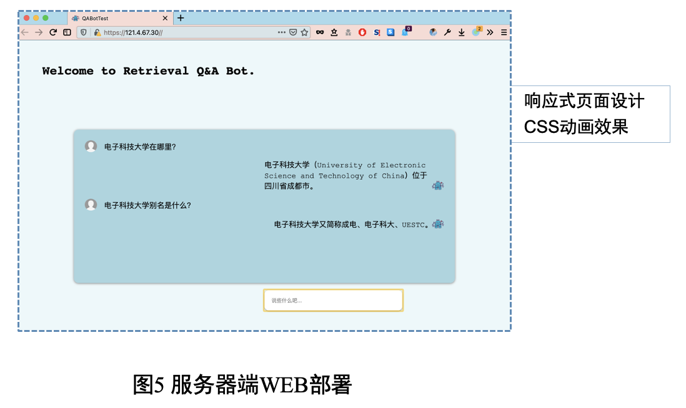
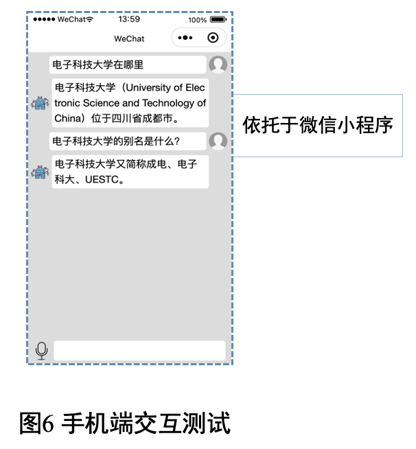

# qaRetreivalBot

一个基于传统检索与语言模型相似度匹配的QA系统前后端

## 参考项目与修改

[chatbot_simbert](https://github.com/ZJJDJJ/chatbot_simbert)是本项目的原始项目。运行说明可参考原始项目。

本项目对原始项目做了一下修改：

- 对每个小模块的测试代码修改，让每个模块的测试代码都能跑通。
- 适当添加注释有助于理解。经过搜索发现，BM25模块的代码参考github bm25Okapi项目。Simbert匹配的模块代码在苏剑林大神的bert4keras中作为demo，并随着bert4keras的更新同步更新demo。
- 实际部署到云服务器的过程中发现原项目提供的sanic框架无法解决本机ip跨域问题，故作修改。部署经验可查看博客[利用Gunicorn和Nginx在服务器上部署一个Flask API](https://machacroissant.github.io/2021/03/29/gunicorn-nginx-flask-api/)的记录。

## 实际运行

为了验证效果，买了一个云服务器对该问答系统进行部署。由于买的轻量应用服务器，Gunicorn的并行书只可设置为1，否则会无法运行。部署在服务器上的样例数据很少，大概二十几个，仅参考。

Web与小程序页面可以在forntend文件夹中分别找到。

前后端交互流程如下：

云服务器的Web部署如下图。

微信开发工具中测试界面如下，未实际部署到微信。

